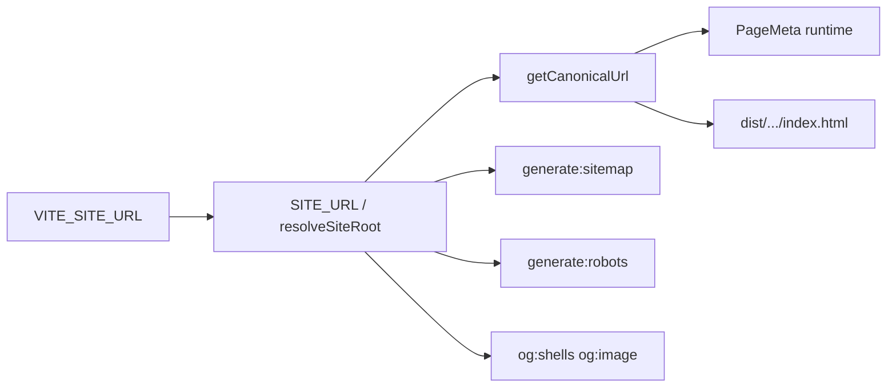

# Cutover на домен `https://vkraynosti.ru`

Пошаговый туториал по переходу prod-сайта «Вкрайности» с технического домена TimeWeb  
(`*.twc1.net`) на постоянный домен `**https://vkraynosti.ru**`.

**Целевое состояние prod (ветка `web-vkr`, TimeWeb App):**


| Параметр      | Значение                             |
| ------------- | ------------------------------------ |
| Публичный URL | `https://vkraynosti.ru`              |
| Base path SPA | `/` (`VITE_BASE_PATH=/`)             |
| Медиа UI      | CDN/S3 (без изменений URL)           |
| OG-preview    | JPEG на App-домене (`vkraynosti.ru`) |
| GitHub Pages  | staging/dev (`main`), не prod        |


---

## 1. Главный принцип: один SSOT для домена

**Не хардкодить** `vkraynosti.ru` в JSX и данных туров.

Канонический origin задаётся **одной переменной окружения**:

```text
VITE_SITE_URL=https://vkraynosti.ru
```

Без trailing slash (код сам нормализует).

Из неё на этапе сборки автоматически строятся:


| Что                                              | Откуда                                                               |
| ------------------------------------------------ | -------------------------------------------------------------------- |
| `canonical`, `og:url`, `twitter:url`             | `getCanonicalUrl()` → `src/constants/siteUrl.ts` + `canonicalUrl.ts` |
| JSON-LD (`Organization`, `WebSite`, breadcrumbs) | `src/constants/seo.ts` → `SITE_URL`                                  |
| `og:image` (shell)                               | `getOgShellAbsoluteImageUrl()` → origin App                          |
| `public/sitemap.xml`                             | `npm run generate:sitemap` → `resolveSiteRoot()`                     |
| `public/robots.txt`                              | `npm run generate:robots`                                            |
| OG-shell HTML                                    | `npm run og:shells` (build-time)                                     |


**Runtime** (`PageMeta.tsx`, Helmet): те же helpers, значения попадают в браузер после загрузки JS.

**Fallback без env:** `https://mrdudekowski.github.io/vkraynosti` — только для `main`/GitHub Pages. На TimeWeb prod **обязательно** задать `VITE_SITE_URL`.

---

## 2. Карта: что меняется, что — нет

### Меняется при cutover

- DNS домена `vkraynosti.ru` → TimeWeb App
- TLS-сертификат на новом домене
- `VITE_SITE_URL` в TimeWeb App и GitHub Actions (ветка `web-vkr`)
- Сгенерированные `sitemap.xml`, `robots.txt`, OG-shell в `dist/`
- Яндекс.Вебмастер / Google Search Console — новое свойство
- (Рекомендуется) 301-редирект со старого `*.twc1.net` на `vkraynosti.ru`

### Не меняется


| Компонент                                   | Почему                                                   |
| ------------------------------------------- | -------------------------------------------------------- |
| `VITE_PUBLIC_ASSET_BASE_URL` (CDN)          | Медиа остаются на S3/CDN                                 |
| `VITE_TOUR_REQUEST_ENDPOINT_URL` (GAS)      | URL деплоя Google Apps Script не зависит от домена сайта |
| `VITE_TOUR_SCHEDULE_ENDPOINT_URL` / S3 JSON | Данные туров на CDN/S3                                   |
| `VITE_BASE_PATH=/`                          | Уже корень для TimeWeb                                   |
| Контент `src/data/*.ts`                     | Тексты туров без URL                                     |
| Telegram / Max ссылки в `contacts.ts`       | `@vkraynosti`, `t.me/vkraynosti`                         |


### Не требует правки кода (если env задан)

Файлы ниже **читают** `VITE_SITE_URL` при сборке — достаточно обновить env и пересобрать:

```text
src/constants/siteUrl.ts
src/constants/seo.ts
src/constants/canonicalUrl.ts
scripts/generate-sitemap.mjs
scripts/generate-robots.mjs
scripts/lib/seoRoutes.mjs
scripts/lib/renderOgShellHead.ts
scripts/lib/runGenerateOgShells.ts
scripts/verify-og-shells.ts
```

---

## 3. Чек-лист перед cutover

- CI на `web-vkr` зелёный
- S3/CDN синхронизирован (`npm run sync:s3` или GitHub Actions)
- Доступ к DNS-зоне `vkraynosti.ru`
- TLS на TimeWeb App (Let's Encrypt / свой сертификат)
- Резерв: текущий `*.twc1.net` продолжает работать до переключения DNS
- План 301 со старого домена (минимум 30–90 дней)

---

## 4. TimeWeb Cloud

### 4.1. DNS

В панели регистратора / DNS:

1. Добавить домен `vkraynosti.ru` в **TimeWeb App Platform** (привязка сайта).
2. Установить записи по инструкции TimeWeb (обычно **A** / **AAAA** или **CNAME** на App).
3. Дождаться выпуска TLS (HTTPS).

Проверка:

```powershell
curl.exe -sI "https://vkraynosti.ru/"
```

Ожидается: `HTTP/1.1 200` (или 308 на `/` со слэшем), валидный HTTPS.

### 4.2. App Platform — переменные окружения

Панель TimeWeb → приложение `vkraynosti` → **Environment variables**:


| Переменная                        | Новое значение                          | Комментарий            |
| --------------------------------- | --------------------------------------- | ---------------------- |
| `**VITE_SITE_URL`**               | `https://vkraynosti.ru`                 | **Главная замена URL** |
| `VITE_BASE_PATH`                  | `/`                                     | Корневой домен         |
| `VITE_PUBLIC_ASSET_BASE_URL`      | `https://4unja6slv5.cdn.twcstorage.ru/` | **Не менять** (CDN)    |
| `VITE_PUBLIC_S3_BASE_URL`         | как CDN или пусто                       | JSON расписания        |
| `VITE_TOUR_REQUEST_ENDPOINT_URL`  | без изменений                           | GAS `/exec`            |
| `VITE_TOUR_SCHEDULE_ENDPOINT_URL` | без изменений                           | если используется      |
| `VITE_YANDEX_METRIKA_ID`          | без изменений                           | счётчик                |


### 4.3. Сборка и деплой


| Параметр         | Значение                     |
| ---------------- | ---------------------------- |
| Build command    | `npm run build:deploy`       |
| Output directory | `dist`                       |
| Autodeploy       | **выключен** (ручной деплой) |


`build:deploy` выполняет:

```text
generate:sitemap  → public/sitemap.xml (vkraynosti.ru)
generate:robots   → public/robots.txt
build             → Vite + prune CDN из dist
og:shells         → статические HTML + OG JPEG на App-домене
```

После смены env → **новый ручной Deploy** в панели TimeWeb.

### 4.4. Редирект со старого домена (рекомендуется)

Настроить на уровне TimeWeb / Caddy **301**:

```text
https://mrdudekowski-vkraynosti-61ea.twc1.net/*
  → https://vkraynosti.ru/$1
```

Сохранить path и query. Это важно для:

- старых ссылок в Telegram / WhatsApp;
- индексации (передача canonical).

### 4.5. CDN / S3

**URL CDN не менять** при cutover домена App.

Проверить в панели CDN:

- robots «не индексировать зеркало» (CDN не должен быть canonical);
- CORS разрешает origin `https://vkraynosti.ru` (если есть ограничения по Referer/Origin).

Файлы CORS-примеров: `TimeWebDoc/examples/s3-cors.json`.

---

## 5. GitHub

### 5.1. Repository Variables

`Settings → Secrets and variables → Actions → Variables`:


| Variable                     | Ветка `web-vkr` | Новое значение          |
| ---------------------------- | --------------- | ----------------------- |
| `**VITE_SITE_URL`**          | prod TimeWeb    | `https://vkraynosti.ru` |
| `VITE_BASE_PATH`             | prod            | `/`                     |
| `VITE_PUBLIC_ASSET_BASE_URL` | prod            | без изменений           |
| Остальные `VITE_`*           | обе             | без изменений           |


Шаблон: `TimeWebDoc/examples/env.branches.example`, `TimeWebDoc/examples/github-secrets-checklist.txt`.

### 5.2. CI (`.github/workflows/ci.yml`)

На push `web-vkr` CI уже передаёт `vars.VITE_SITE_URL` в:

- `generate:sitemap` / `generate:robots`
- `build`
- `og:shells`
- `verify:og-shells`

После обновления variable → push в `web-vkr` → проверить артефакт `**dist-web-vkr`**.

### 5.3. GitHub Pages (`main`)

**Prod cutover не требует** менять Pages URL, если staging остаётся на:

```text
https://mrdudekowski.github.io/vkraynosti/
```

На `main` `**VITE_SITE_URL` можно не задавать** — сработает default `github.io`.

Опционально после cutover:

- отключить `deploy.yml` для prod-трафика;
- оставить Pages только для preview/QA.

### 5.4. Локальный `.env` (не коммитить)

```env
VITE_SITE_URL=https://vkraynosti.ru
VITE_BASE_PATH=/
VITE_PUBLIC_ASSET_BASE_URL=https://4unja6slv5.cdn.twcstorage.ru/
```

См. `.env.example`.

---

## 6. SEO, robots, sitemap, OG

### 6.1. Как формируются URL




### 6.2. robots.txt

Генерируется скриптом `scripts/generate-robots.mjs`:

```text
User-agent: *
Allow: /

Sitemap: https://vkraynosti.ru/sitemap.xml
```

Попадает в `dist/robots.txt` через Vite (`public/`).

**Не редактировать вручную** — только через `VITE_SITE_URL` + `npm run generate:robots`.

### 6.3. sitemap.xml

`scripts/generate-sitemap.mjs` — все индексируемые маршруты (~45):

```text
https://vkraynosti.ru/
https://vkraynosti.ru/tours/summer/summer-10
…
```

> **Примечание:** canonical страниц туров имеет trailing slash (`…/summer-10/`), sitemap сейчас без слэша — не критично для cutover, но можно выровнять отдельной задачей.

### 6.4. Open Graph (Telegram / WhatsApp)

Build-time shells в `dist/tours/.../index.html`:

- `og:url`, `canonical` → `https://vkraynosti.ru/.../`
- `og:image` → `https://vkraynosti.ru/tours/{id}/cover.jpg` (App, не CDN)

После cutover:

1. Задеплоить с новым `VITE_SITE_URL`.
2. Проверить tour shell и `/og-test-telegram-20260610/`.
3. Обновить кэш Telegram (@WebpageBot) **новым URL** на `vkraynosti.ru`.

### 6.5. JSON-LD

`ORGANIZATION_SCHEMA`, `WEBSITE_SCHEMA`, breadcrumbs — поле `url` из `SITE_URL`. Обновятся автоматически при сборке.

### 6.6. public/404.html (шаблон)

Исходник `public/404.html` содержит legacy GitHub Pages OG — **перезаписывается** на этапе `og:shells` (`patch404OgShell.ts`) в `dist/404.html` с App-origin.

После cutover проверить:

```powershell
curl.exe -sL "https://vkraynosti.ru/404.html" | Select-String "og:image|github.io"
```

Не должно быть `github.io`.

---

## 7. Google Apps Script (GAS)

### 7.1. Заявки с сайта (`integrations/telegram-leads-gas/`)


| Что                               | Действие                                                                                            |
| --------------------------------- | --------------------------------------------------------------------------------------------------- |
| URL Web App (`…/macros/s/…/exec`) | **Не менять** — это endpoint GAS                                                                    |
| `VITE_TOUR_REQUEST_ENDPOINT_URL`  | **Без изменений** в TimeWeb/GitHub                                                                  |
| `sourceUrl` в заявке              | Берётся из `window.location.href` в браузере — **автоматически** станет `https://vkraynosti.ru/...` |


В `Code.gs` есть пример с `https://vkraynosti.ru/...` — это только документация/curl-пример, не конфиг.

### 7.2. Расписание туров (`integrations/tour-schedule-gas/`)


| Что                             | Действие                                    |
| ------------------------------- | ------------------------------------------- |
| S3 upload (`S3Upload.gs`)       | **Не менять** — endpoint `s3.twcstorage.ru` |
| JSON на CDN                     | URL файлов не зависит от домена сайта       |
| `VITE_PUBLIC_S3_BASE_URL` / CDN | **Без изменений**                           |


GAS **не содержит** prod-домен сайта в логике публикации.

---

## 8. Яндекс и Google (после cutover)

### 8.1. Яндекс.Вебмастер

1. Добавить сайт `https://vkraynosti.ru`.
2. Подтвердить права (DNS / meta / файл).
3. Указать зеркало / главное зеркало `https://vkraynosti.ru`.
4. Отправить sitemap: `https://vkraynosti.ru/sitemap.xml`.
5. Настроить 301 со старого `*.twc1.net` → переезд в Вебмастере.

### 8.2. Яндекс.Метрика

- Счётчик (`VITE_YANDEX_METRIKA_ID`) — **тот же**.
- В интерфейсе Метрики добавить домен `vkraynosti.ru` к счётчику (если ограничение по доменам).

### 8.3. Google Search Console

1. Новое property `https://vkraynosti.ru`.
2. Submit sitemap.
3. Change of address / 301 со старого домена.

---

## 9. Пошаговый порядок cutover (рекомендуемый)

### Фаза A — подготовка (без переключения DNS)

1. Обновить `**VITE_SITE_URL`** в GitHub Variables (`web-vkr`).
2. Локально:

```powershell
$env:VITE_SITE_URL = "https://vkraynosti.ru"
$env:VITE_BASE_PATH = "/"
$env:VITE_PUBLIC_ASSET_BASE_URL = "https://4unja6slv5.cdn.twcstorage.ru/"

npm run build:deploy
$env:VITE_SITE_URL = "https://vkraynosti.ru"
npm run verify:og-shells
npm test
```

1. Проверить в `dist/`:
  - `robots.txt` → `Sitemap: https://vkraynosti.ru/sitemap.xml`
  - `tours/summer/summer-10/index.html` → canonical на `vkraynosti.ru`
  - нет `github.io` в OG-shell
2. Push `web-vkr` → CI green → скачать artifact `dist-web-vkr`.

### Фаза B — привязка домена

1. Привязать `vkraynosti.ru` к TimeWeb App, дождаться TLS.
2. Обновить `**VITE_SITE_URL**` в панели TimeWeb App.
3. Ручной Deploy (тот же artifact или свежая сборка на платформе).

### Фаза C — DNS cutover

1. Переключить DNS `vkraynosti.ru` на TimeWeb.
2. Настроить **301** с `*.twc1.net` → `vkraynosti.ru`.
3. Smoke-test (см. §10).

### Фаза D — поисковики и соцсети

1. Яндекс.Вебmaster + Метрика + Google SC.
2. Telegram: новая ссылка `https://vkraynosti.ru/tours/summer/summer-10/` в «Избранном».
3. WhatsApp: убедиться, что preview на новом домене OK.

---

## 10. Проверка после cutover

### PowerShell

```powershell
# Главная
curl.exe -sI "https://vkraynosti.ru/"

# robots + sitemap
curl.exe -sL "https://vkraynosti.ru/robots.txt"
curl.exe -sL "https://vkraynosti.ru/sitemap.xml" | Select-String "vkraynosti.ru" | Select-Object -First 5

# SEO shell тура
curl.exe -sL "https://vkraynosti.ru/tours/summer/summer-10/" |
  Select-String -Pattern "canonical|og:url|og:image"

# OG JPEG
curl.exe -sI "https://vkraynosti.ru/tours/summer-10/cover.jpg"

# Редирект со старого домена
curl.exe -sI "https://mrdudekowski-vkraynosti-61ea.twc1.net/tours/summer/summer-10/"
```

### Ожидаемые результаты


| Проверка             | OK                                                |
| -------------------- | ------------------------------------------------- |
| `robots.txt` Sitemap | `https://vkraynosti.ru/sitemap.xml`               |
| canonical тура       | `https://vkraynosti.ru/tours/summer/summer-10/`   |
| `og:image`           | `https://vkraynosti.ru/tours/summer-10/cover.jpg` |
| JPEG                 | 200, `Content-Type: image/jpeg`                   |
| Старый домен         | 301 → `vkraynosti.ru`                             |
| CDN cover            | 200 с CDN URL (UI в браузере)                     |
| GAS заявка           | `sourceUrl` содержит `vkraynosti.ru`              |


### Функциональный smoke

Чек-лист: `TimeWebDoc/examples/staging-smoke-checklist.txt` — пройти на `vkraynosti.ru`.

---

## 11. Rollback

Если нужно откатиться на `*.twc1.net` или GitHub Pages:

1. DNS обратно на старый target.
2. TimeWeb env: `VITE_SITE_URL=https://mrdudekowski-vkraynosti-61ea.twc1.net`.
3. Пересборка + redeploy.
4. S3/CDN **не удалять**.

Подробнее: `TimeWebDoc/examples/cutover-rollback-runbook.txt`.

---

## 12. Справочник: файлы с упоминанием URL


| Файл                                      | Роль                    | Действие при cutover          |
| ----------------------------------------- | ----------------------- | ----------------------------- |
| `**VITE_SITE_URL`** (env)                 | SSOT prod origin        | **→ `https://vkraynosti.ru`** |
| `src/constants/siteUrl.ts`                | Runtime SITE_URL        | env only                      |
| `scripts/lib/seoRoutes.mjs`               | sitemap/robots root     | env only                      |
| `public/robots.txt`                       | в git — artifact        | regenerate при build          |
| `public/sitemap.xml`                      | в git — artifact        | regenerate при build          |
| `public/404.html`                         | шаблон GH Pages         | patched в dist при og:shells  |
| `index.html`                              | SPA shell               | GH script stripped на TimeWeb |
| `.github/workflows/ci.yml`                | CI env                  | GitHub var                    |
| `package.json` `build:deploy`             | deploy pipeline         | без изменений                 |
| `integrations/telegram-leads-gas/Code.gs` | пример curl             | опционально обновить пример   |
| `src/services/sendTourRequestLead.ts`     | `window.location.href`  | auto                          |
| `playwright.config.ts`                    | dev base `/vkraynosti/` | **не менять** (local dev)     |


### Hardcoded defaults (не трогать для TimeWeb prod)

```text
DEFAULT_SITE_URL = https://mrdudekowski.github.io/vkraynosti
```

Используется только когда `VITE_SITE_URL` пуст — норма для `main`/Pages.

---

## 13. FAQ

**Нужно ли менять CDN URL?**  
Нет. `VITE_PUBLIC_ASSET_BASE_URL` остаётся прежним.

**Нужно ли менять GAS deploy URL?**  
Нет. Меняется только origin сайта в SEO/OG.

**Нужно ли коммитить public/sitemap.xml и robots.txt?**  
На `web-vkr` они перегенерируются в `build:deploy`. Коммит опционален; важнее env на TimeWeb при сборке.

**Поможет ли cutover с Telegram preview?**  
Отдельная гипотеза: собственный домен `vkraynosti.ru` может снять ограничения `*.twc1.net`. После cutover повторить тест `/og-test-telegram-20260610/`.

**www vs apex?**  
Рекомендуется выбрать один канон (`https://vkraynosti.ru` или `https://www.vkraynosti.ru`) и 301 с альтернативы. `VITE_SITE_URL` = выбранный канон.

---

## 14. Контакты и ссылки в коде (без изменений)

`src/constants/contacts.ts`:

- Telegram: `https://t.me/vkraynosti`
- Email: `vkraynosti.prim@yandex.ru`

Не привязаны к домену сайта.

---

*Дата документа: 2026-06-10. Ветка: `web-vkr`. Связанные материалы: `TimeWebDoc/examples/env.branches.example`, `TimeWebDoc/examples/cutover-rollback-runbook.txt`.*