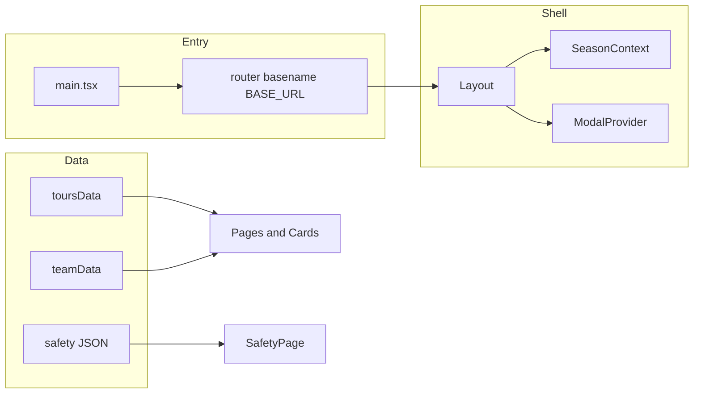

# Чек-лист готовности и статус проекта Vkraynosti

Документ фиксирует аудит кодовой базы, текущий уровень зрелости и шаги до коммерческого продакшена. Отмечайте выполненные пункты в Git при продвижении по дорожной карте.

---

## Краткий вердикт

**Статус:** продуктово-ориентированный MVP с сильной технической базой (архитектура, типизация, токены Tailwind, роутинг, модалки, валидация форм), **не готов как финальный коммерческий продакшен** из‑за контента (заглушки), незавершённой отправки заявок, частичного SEO/брендинга и узкого покрытия тестами.

**Стек (факт):** React 19, Vite 7, React Router 7, Tailwind 3, TypeScript, Zod, Vitest, Playwright, деплой через `.github/workflows/deploy.yml` на GitHub Pages; `basename` и `vite.config.ts` (`base: '/vkraynosti/'`) согласованы с `public/404.html` для SPA.

---

## Архитектура и структура (оценка)

| Область | Наблюдение |
|--------|------------|
| **Маршрутизация** | `src/router.tsx`: `Layout` + ленивые страницы сезонов, тура, безопасности, политики, 404 — ок для масштабирования. |
| **Данные** | Единый слой `src/data/*.ts`, JSON безопасности в `src/data/safety/` — соответствует правилу single source of truth. |
| **Состояние** | Context: `ModalContext`, `SeasonContext`, навигация сезонов — без избыточного Redux. |
| **UI** | Компоненты по зонам (`home/`, `layout/`, `tours/`, `modals/`), хуки `useCarousel`, `useRevealOnScroll` — разделение ответственности хорошее. |
| **Стили** | `tailwind.config.ts` расширяет тему (цвета, анимации, типографика); кастомные стеки шрифтов подключены из `src/constants/fontFamilyStacks.ts`. |

---

## Сильные стороны (уже «продакшен-качества»)

- **Мета и шаринг:** `src/components/shared/PageMeta.tsx` — title, description, OG/Twitter, preload LCP для героя.
- **Устойчивость:** `src/components/errors/ErrorBoundary.tsx`, ручной `scrollRestoration` в `src/main.tsx`.
- **Доступность модалок:** `useBodyScrollLock`, `useModalFocusTrap`, aria на диалоге заявки.
- **Форма заявки:** Zod-схема + тесты `src/validation/tourRequestSchema.test.ts`, `src/components/modals/TourRequestModal.test.tsx`.
- **Сборка:** manual chunks для vendor в Vite, CI собирает `tsc -b && vite build`.

---

## Критические пробелы до «настоящего» продакшена

1. **Контакты и доверие** — в `src/constants/contacts.ts` телефон и `tel:` — плейсхолдеры (`+7 (XXX)...`, `tel:+7XXXXXXXXXX`). Для публикации нужны реальные данные и согласованность с футером/мессенджерами.

2. **Заявка на тур** — `src/components/modals/TourRequestModal.tsx`: отправка имитируется (`setTimeout`), данные уходят в `console.log`. Нужен бэкенд, serverless или сторонний endpoint + политика приватности/согласия под реальную обработку ПДн.

3. **Контент безопасности** — все сезонные блоки в `spring/summer/fall/winter.json` помечены `TODO: заполнить...`; на `src/pages/SafetyPage.tsx` логика `PLACEHOLDER_PREFIX = 'TODO'` скрывает неполный контент — для продакшена нужен финальный текст эксперта/юриста.

4. **Медиа** — в `src/data/toursData.ts` много `IMAGES.tours.placeholder`; `src/data/teamData.ts` — только placeholder-фото. Нужны реальные ассеты и оптимизация (форматы, размеры, `srcset` при необходимости).

5. **Брендинг и статика** — `index.html` и публичный favicon по умолчанию `public/vite.svg`; нет `robots.txt` / sitemap в `public/` для индексации.

6. **CI** — в `.github/workflows/deploy.yml` перед `build` выполняются `lint` и `test`; при необходимости добавьте отдельный workflow на PR или E2E в CI с кешем Playwright.

7. **Зависимости** — `docx` в `package.json` не используется в `src/` — кандидат на удаление или обоснование (скрытая зависимость).

8. **Правила проекта vs код** — кастомная иконка MAX в `src/components/icons/MaxMessengerIcon.tsx` (не FontAwesome) — осознанное исключение; в `src/constants/seasonNavbarAppearance.ts` есть TODO про замену иконок сезонов.

---

## Детальный чек-лист готовности к продакшену

### A. Контент и блоки сайта

- [ ] Реальные телефон, email, мессенджеры — только в `src/constants/contacts.ts` + проверка всех ссылок.
- [ ] Туры: замена placeholder-изображений, актуальные цены/даты/условия.
- [ ] Команда: фото и тексты в `src/data/teamData.ts`.
- [ ] Безопасность: заполнение JSON по сезонам + общий `src/data/safetyData.ts` при необходимости.
- [ ] Политика конфиденциальности: юридическая вычитка `UI.privacyPage` в `src/constants/ui.ts`.
- [ ] Главная: тексты в `src/constants/ui.ts` / данные — единообразие с SEO-описаниями.

### B. Функциональность и интеграции

- [ ] Endpoint заявки (или email-сервис / CRM) + обработка ошибок и rate limiting.
- [ ] Убрать или завернуть `console.log` за флаг dev / заменить на безопасный логгер.
- [ ] Опционально: аналитика (YM/GA), цели конверсии, cookie-баннер при необходимости по юрисдикции.

### C. SEO и соцсети

- [ ] Favicon и apple-touch-icon под бренд.
- [ ] `robots.txt`, `sitemap.xml` с учётом `SITE_URL` и базового пути `/vkraynosti/`.
- [ ] Проверка `og:image` — абсолютные URL (сейчас через `SITE_URL` в `src/constants/contacts.ts` + пути из `src/constants/images.ts`).
- [ ] Структурированные данные (JSON-LD Organization/Tour) — по приоритету.

### D. Производительность и качество

- [ ] Lighthouse / Web Vitals на ключевых страницах (главная, деталь тура).
- [ ] Проверка LCP: preload в `PageMeta` уже есть на части страниц — выровнять по всем «героям».
- [ ] Lazy images: уже `PlaceholderImage` / приоритет первой карточки — при росте галерей — light list.

### E. Тестирование и качество кода

- [ ] Расширить E2E: навигация по турам, модалка заявки, критичные формы (`e2e/navbar.spec.ts` сейчас — только navbar/dock).
- [x] CI: `npm run lint && npm test` перед деплоем (см. `.github/workflows/deploy.yml`); опционально — e2e в CI с кешом браузера.
- [ ] Покрытие критичных утилит и хуков при изменениях.

### F. Доступность и i18n

- [ ] Прогон клавиатурой по модалкам и формам (уже частично заложено).
- [ ] Язык: `lang="ru"` в HTML — ок; при расширении — отдельная стратегия.

### G. Дизайн и полировка

- [ ] Замена placeholder-иконок сезонов (TODO в `seasonNavbarAppearance`).
- [ ] Визуальная консистентность после смены реальных фото (кропы, соотношения сторон).
- [ ] Тёмные секции: соблюдение `bg-surface-dark` / `bg-surface-light` по гайдлайну проекта.

### H. Операции и безопасность

- [ ] Секреты не в репозитории; для форм — env в CI только для публичных ключей (reCAPTCHA, публичный endpoint).
- [ ] HTTPS на GitHub Pages — по умолчанию да; проверить смешанный контент при внешних картинках.

---

## Рекомендуемые шаги дальнейшей разработки (приоритет)

1. **Контент и доверие:** контакты, фото, тексты безопасности — без этого сайт не закрывает бизнес-цель.
2. **Заявки:** реальная отправка + юридически корректная обработка данных.
3. **SEO/бренд:** favicon, robots/sitemap, финальные meta на всех страницах из единого источника (часть строк на главной сейчас захардкожена в `src/pages/Home.tsx` — имеет смысл вынести в `ui.ts` для SSoT).
4. **Качество поставки:** lint+test в CI, больше E2E на конверсию.
5. **Полировка UX/UI** и удаление технического долга (unused deps, TODO в данных).

---

## История документа

- Создан по результатам аудита структуры, архитектуры и рисков продакшена (март 2026).
